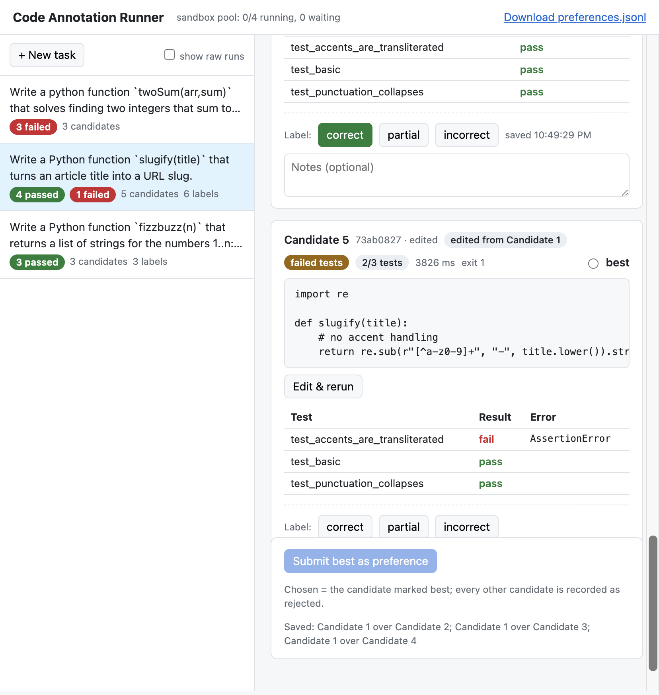
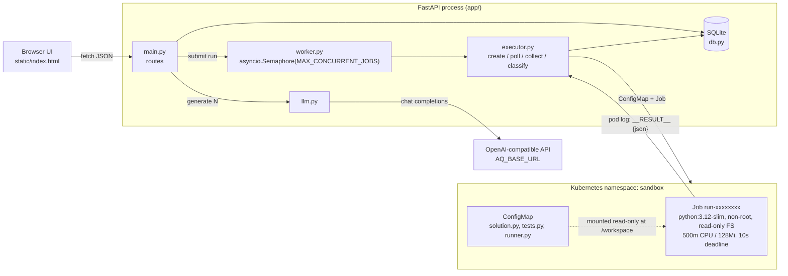

# Code Annotation Runner

A small service for collecting preference data on LLM-written code. You submit a task (a prompt plus
hidden pytest-style tests). An LLM generates N Python candidates, and each candidate runs in its own
locked-down Kubernetes Job. The results are stored in SQLite: status, exit code, per-test pass/fail,
stdout/stderr and duration. A human then reviews the candidates in a browser UI, labels each one
correct/partial/incorrect, and picks the best. Each pick becomes chosen-vs-rejected pairs exported as
JSONL for training. Everything runs locally against Docker Desktop's Kubernetes. The only external
dependency is an OpenAI-compatible LLM endpoint, and code can also be run without the LLM.



## Architecture



How one run works:
1. The row is inserted as `queued`.
2. The pool waits for a free slot.
3. The executor creates a ConfigMap holding the candidate, the tests and
   [`app/runner_template.py`](app/runner_template.py). It then creates a Job that mounts the ConfigMap
   and makes the Job the ConfigMap's owner, so Kubernetes deletes the ConfigMap along with the Job.
4. The executor polls every 0.5s until the Job finishes.
5. The runner sets rlimits, imports the solution and the tests, calls each `test_*` function, and
   prints one `__RESULT__ {json}` line. It exits 0 if every test passed, 1 if some failed, and 2 if
   importing or collecting failed.
6. The executor combines that line with the pod's termination state to pick a status: `passed`,
   `failed_tests`, `error`, `timeout`, `oom` or `infra_error`.

## Run it from a fresh clone

Prerequisites: Docker Desktop with Kubernetes enabled, and Python 3.10+ (this was developed on 3.10;
the spec asks for 3.11+). `jq` is only needed for the demo.

```bash
git clone https://github.com/HannahDan/code-exec.git && cd code-exec
kubectl config use-context docker-desktop
cp .env.example .env          # then put your key in .env: AQ_API_KEY=...
make setup                    # pip install -r requirements.txt, docker pull python:3.12-slim
make k8s-apply                # namespace "sandbox" + deny-all NetworkPolicy
make test                     # full suite against the real cluster, log -> artifacts/test_output.txt
make run                      # http://localhost:8000
make demo                     # end-to-end demo on :8765, writes artifacts/demo_*
```

- **LLM configuration** comes only from environment variables: `AQ_API_KEY`, `AQ_BASE_URL` (default
  `https://api.aqinference.com/v1`) and `LLM_MODEL` (default `openai/gpt-4.1-mini`). `make run` and
  `make demo` load `.env` if it exists, and `.env` is gitignored.
- **Without a key**, everything except generation works: `POST /runs` and the whole test suite included.
  `POST /tasks` then produces placeholder candidates that fail visibly instead.
- **Other settings:** `MAX_CONCURRENT_JOBS` (default 4) caps parallel Jobs, and `CODE_EXEC_DB` moves the
  SQLite file.
- **`make clean`** deletes `code_exec.db` and the `sandbox` namespace.
- **`make demo`** always starts from a fresh `demo.db`, deleting the previous one.

## API

| Method and path | Purpose |
|---|---|
| `GET /healthz` | Checks the DB and Kubernetes; includes worker-pool stats |
| `POST /runs` | Run raw `{code, tests}` without the LLM (202) |
| `GET /runs/{id}` | Poll a run |
| `POST /tasks` | `{prompt, tests, n_candidates}`: generate and run candidates in the background (202) |
| `GET /tasks`, `GET /tasks/{id}` | Task list with summary counts; full detail with candidates, latest runs, labels, preferences |
| `POST /tasks/{id}/annotations` | Label a candidate `correct` / `partial` / `incorrect`, with optional notes |
| `POST /tasks/{id}/preference` | `{chosen_candidate_id, rejected_candidate_ids}`, stored as one row per rejected candidate |
| `POST /tasks/{id}/candidates` | Edit & rerun: run edited code as a new candidate linked to its parent |
| `POST /tasks/{id}/rerun` | Rerun every candidate, optionally with replaced `tests` |
| `DELETE /tasks/{id}` | Delete a task and everything attached to it (409 while runs are in flight) |
| `GET /export/preferences.jsonl` | One line per pair: prompt, both candidates' code and latest run, `identical_code` flag |

## Security model

Candidate code is treated as hostile. Each row below is either demonstrated by a test that runs on the
cluster ([`tests/test_executor.py`](tests/test_executor.py), with results recorded in
[`artifacts/adversarial_results.json`](artifacts/adversarial_results.json)) or labelled as
configuration only.

| Control | How | Evidence |
|---|---|---|
| Wall-clock limit | `activeDeadlineSeconds: 10`, `backoffLimit: 0` | `test_timeout`: `while True` → `timeout` after ~9.5s |
| Memory limit | cgroup `memory: 128Mi` | `test_memory_bomb`, `test_memory_growing_list`: `oom`, exit 137 |
| CPU limit | `cpu: 500m` requests = limits | configuration only (no dedicated test) |
| Fork bombs | `RLIMIT_NPROC=64` plus the memory cgroup | `test_fork_bomb_is_contained`: `oom` in ~9s, next run passes; `test_nproc_limit_caps_forks`: `fork()` refused with EAGAIN after 63 children |
| Filesystem | `readOnlyRootFilesystem`, code mounted read-only, only `/tmp` writable (16Mi `emptyDir`), `RLIMIT_FSIZE=10MB` | `test_read_only_filesystem`: world-writable `/var/tmp` fails with EROFS, `/workspace` fails with EROFS, `/tmp` works |
| Privilege | UID 65534, `runAsNonRoot`, `allowPrivilegeEscalation: false`, drop ALL capabilities, seccomp `RuntimeDefault` | configuration; the read-only FS test also runs as that user |
| Cluster API access | `automountServiceAccountToken: false`, `enableServiceLinks: false` | configuration only |
| Output flooding | Log read capped at 64 KiB, `truncated` flag, result line recovered from the tail | `test_huge_stdout_is_truncated` (10 MB of stdout) |
| Broken or hostile code | Syntax/import errors → `error`; a missing result line is flagged, never a crash | `test_syntax_error` |
| Infrastructure failures | Image pull errors, pods that never start, and a 60s wait cap → `infra_error` | `test_missing_image_is_infra_error` (~3.4s) |
| Concurrency | `MAX_CONCURRENT_JOBS` semaphore; a Job is created only after a slot is acquired | `test_concurrency_twelve_runs_bounded`: 12/12 passed, cluster peak 4 unfinished Jobs over 83 samples |
| UI injection | Candidate code and output are inserted as text nodes only | `test_ui_never_uses_innerhtml` |

**Not covered. Don't rely on these:**

- **Network egress is NOT blocked on this setup.** `k8s/networkpolicy.yaml` (deny all ingress and
  egress) is applied, but Docker Desktop's networking doesn't enforce NetworkPolicy. A sandbox pod
  fetched `https://example.com` and got HTTP 200 (`test_outbound_network`, marked xfail and recorded as
  `policy_enforced: false`). Enforcing it needs a CNI that implements NetworkPolicy, such as Calico or
  Cilium, or a sandbox runtime with no network at all. The test would pass unchanged on such a cluster,
  and it checks that the host is online so a missing internet connection can't fake a pass.
- **Shared kernel.** Pods are ordinary containers on the node's kernel, with no gVisor, Kata or
  microVM. A kernel exploit escapes the sandbox.
- **`RLIMIT_NPROC` is per UID, not per pod.** Every sandbox pod runs as UID 65534, so all of them share
  one 64-process budget. The limit test saw 63 forks in one run and 62 in the next, because a leftover
  process still held a slot. One fork bomb can make `fork()` fail in other candidates' pods. Fixes:
  a distinct UID per pod, user namespaces, or the kubelet's `podPidsLimit` (not configured here).
- **No authentication** on the API or UI, and **no secret isolation** beyond env vars. The server binds
  `0.0.0.0` under `make run`.
- Hidden tests run in the same process as the candidate, so a determined candidate can read or tamper
  with them (for example by monkeypatching `assert` targets). Fine for annotation, not for a benchmark.

## Tradeoffs

- **ConfigMap instead of building an image per run.** Code arrives in a ConfigMap mounted read-only
  into a stock `python:3.12-slim`. It needs no registry and no image build (seconds or more per build),
  and the image is always cached (`IfNotPresent`). ConfigMaps are capped at about 1 MiB, which is ample
  for single-file solutions, and the ownerReference lets Kubernetes garbage-collect them with the Job.
- **Polling instead of watch.** The executor polls Job and pod status every 0.5s from a worker thread.
  Watches are more efficient but have reconnect, resourceVersion and missed-event edge cases. At up to
  4 concurrent Jobs, polling is simpler to get right and adds under 0.5s of latency. The 60s wait cap
  bounds a run even if the cluster misbehaves.
- **SQLite.** No service to run. WAL mode lets the UI read while workers write, and the schema is five
  small tables. The cost is a single writer and a single process, which matches the per-process worker
  pool (see Limitations).
- **Edit & rerun creates a new candidate instead of mutating one.** Labels and preference pairs refer to
  candidate ids, and the export reads the code at export time. Editing in place would silently change
  what a past preference pair compared. The edit is stored with `source: edited` and `parent_id`.
- **Plain HTML with polling instead of a frontend framework.** One file, no build step. It polls every
  2s while something is running and every 10s otherwise. It redraws only when the data changed, and not
  while you're typing in a textarea.

## Limitations

- **One server process.** `MAX_CONCURRENT_JOBS` is enforced per process, so two server processes would
  each allow that many Jobs.
- **Generation isn't recovered after a crash.** Startup recovery re-queues or re-attaches runs, but
  LLM generation lost to a crash is not resumed.
- `duration_ms` is wall-clock from Job creation, so it includes about 3–4s of pod start-up on Docker
  Desktop. It isn't the test execution time.
- On this 4-CPU node only about 6–7 sandbox pods fit at 500m each. A higher `MAX_CONCURRENT_JOBS` leaves
  pods `Pending`, which are then reported as `infra_error`.
- The concurrency test is timing-sensitive. Once, right after the fork-bomb and memory tests, one of its
  trivial runs hit the 10s deadline while the node was still busy. It passed when rerun and in the
  committed run.
- The UI isn't responsive: below about 900px wide, the candidate panel gets squeezed.

## What I'd do next

- **Watch API** with resourceVersion resume in place of polling, and a shared informer for pod state.
- **Stronger isolation:** gVisor or Kata via a `RuntimeClass`, an enforcing CNI for egress, `podPidsLimit`
  or per-pod UIDs, and a ResourceQuota on the `sandbox` namespace as a backstop.
- **Per-language images** (and pinned dependency images for Python) chosen per task.
- **Result caching** keyed on hash(code, tests, image), which would also skip the byte-identical
  candidates the LLM produces surprisingly often (see the `identical_code` pairs in the export).
- **Auth** for annotators, and attributing labels and preferences to a user.
- **Horizontal workers** behind a real queue (Redis or Postgres `SKIP LOCKED`) with leases in place of an
  in-process semaphore, and Postgres in place of SQLite.

## Evidence

| File | What it shows |
|---|---|
| [`artifacts/test_output.txt`](artifacts/test_output.txt) | Full `make test` log: 46 passed, 1 xfailed (network egress) |
| [`artifacts/adversarial_results.json`](artifacts/adversarial_results.json) | Per-case status, exit code, duration and probe output for each adversarial test, the concurrency peaks, and the recovery re-attach |
| [`artifacts/demo_output.txt`](artifacts/demo_output.txt) | `make demo` transcript: raw run, LLM task, annotations, preference |
| [`artifacts/demo_task.json`](artifacts/demo_task.json), [`demo_raw_run.json`](artifacts/demo_raw_run.json), [`demo_tasks_list.json`](artifacts/demo_tasks_list.json) | API responses captured by the demo |
| [`artifacts/demo_kubectl.txt`](artifacts/demo_kubectl.txt), [`demo_server.log`](artifacts/demo_server.log) | Jobs and pods in the cluster after the demo; server log |
| [`artifacts/preferences.jsonl`](artifacts/preferences.jsonl) | Export from an annotation session: 9 pairs, 2 of them flagged `identical_code` |
| [`artifacts/ui_screenshot.png`](artifacts/ui_screenshot.png) | The annotator UI showing an edited candidate |
| [`NOTES.md`](NOTES.md) | Decisions, issues hit, and findings per milestone |
